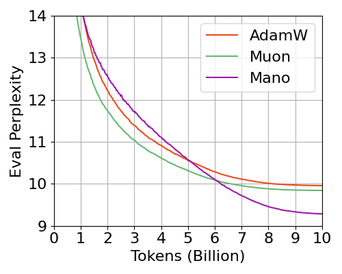
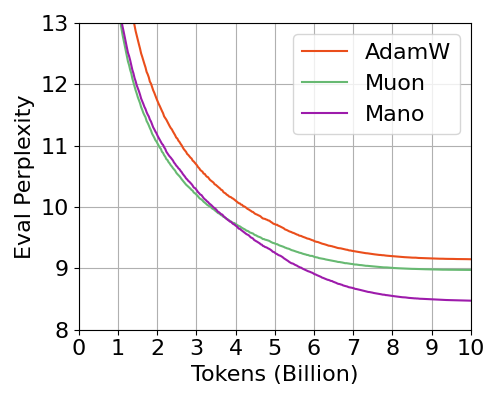
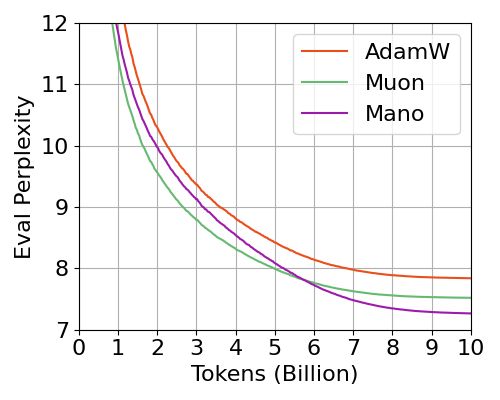
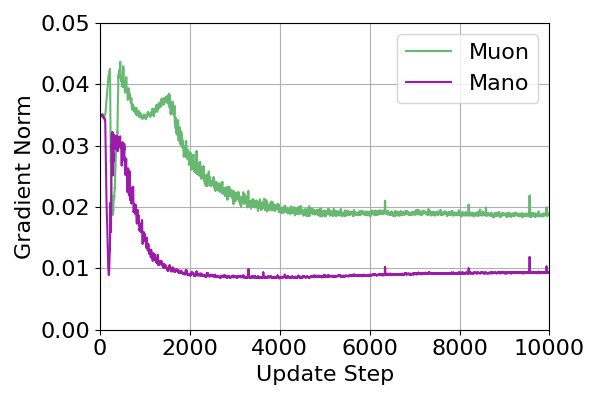
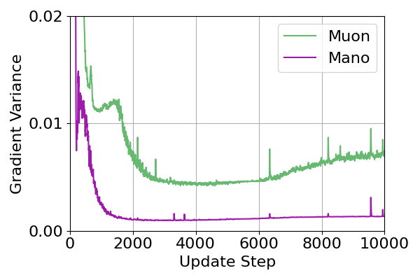
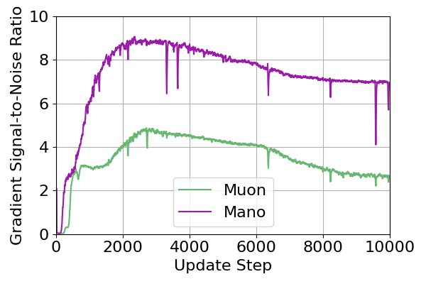
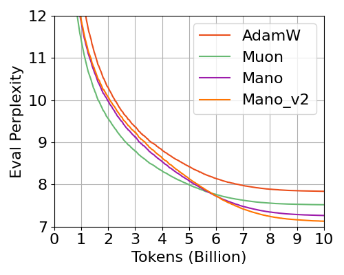
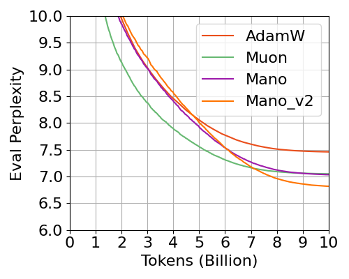

# Mano: Manifold Normalized Optimizer

[](https://arxiv.org/abs/2601.23000)

The official code of "Mano: Restriking Manifold Optimization for LLM Training".

By innovatively projecting the momentum onto the tangent space of a rotational Oblique manifold without constraining the model's parameters, we propose a novel, powerful, and efficient optimizer Mano, that is the first to bridge the performance gap between manifold optimization and modern optimizers for training LLMs, to the best of our knowledge.

| LLaMA-130M / Pile | LLaMA-350M / Pile | LLaMA-1.3B / Pile |
| :---: | :---: | :---: |
|  |  |  |

In our experiments, Mano consistently and significantly outperforms AdamW and Muon even with less memory consumption and computational complexity.


### Core Implementation
```python
# 0. Rotate manifold dimension once per optimizer step (k <- t mod 2)
dim = int(group["steps"] % 2)

# 1. Compute the tangent momentum by projection onto the parameter-space manifold of the Oblique surface.
p_unit = p.data / torch.clamp(torch.norm(p.data, p=2, dim=dim, keepdim=True), min=eps)
tangent_momentum = g - (torch.sum(g * p_unit, dim=dim, keepdim=True) * p_unit)

# 2. Map the tangent momentum to the Oblique Manifold with rotation between parameter axes (rows/columns for 2-D LLM params).
u = tangent_momentum / torch.clamp(torch.norm(tangent_momentum, p=2, dim=dim, keepdim=True), min=eps)
```

### A Gradient Norm Interpretation

| Gradient Norm | Gradient Variance | Signal-to-Noise Ratio |
| :---: | :---: | :---: |
|  |  |  |

The gradient signal-to-noise ratio (SNR) of Mano is notably higher than that of Muon, which may promote faster convergence and better training stability.


### Example Usage:

```python
from mano import Mano

# Setup trainable parameters, track the input and output layer
trainable_params = [p for p in model.parameters() if p.requires_grad]
head_params = [*model.lm_head.parameters(), *model.model.embed_tokens.parameters()]
head_param_ids = {id(p) for p in head_params}

# Split up parameters for Mano (Muon) and AdamW
mano_params = [p for p in trainable_params if p.ndim >= 2 and id(p) not in head_param_ids]
mano_ids = {id(p) for p in mano_params}
adamw_params = [p for p in trainable_params if id(p) not in mano_ids]

# Initialize the Mano Optimizer
optimizer = Mano(mano_params=mano_params, lr=1e-3, wd=0.01, momentum=0.95, adamw_params=adamw_params, adamw_betas=(0.9, 0.95), adamw_eps=1e-8)
```

## [2026.3.14] Mano_v2 

We propose the following modifications to Mano improves pretraining performance from large-scale empirical studies.

- Row/Column normalization of the Parameters are unnecessary, and removing it improves performance in final convergence.
- Regarding the eps in momentum normalization, addition performs better than clamping.
- Nesterov momentum performs slightly better under data scaling experiments, so its default value is now set to True.

### Core Implementation

```python
tangent_mt = g - (torch.sum(g * p.data, dim=dim, keepdim=True) * p.data)
u = tangent_mt / (torch.norm(tangent_mt, p=2, dim=dim, keepdim=True) + eps)
```

We have released the optimizer code in `mano_v2.py`. With all attempts to simplify Mano's implementation, we conclude that Mano's performance can be attributed to the two single operation: **tangent space projection** and **row/column normalization** of the gradient steps. 
- Axis-wise tangent projection may have been greatly overlooked in high-dimensional optimization, with the potential to generalize to other optimizers, including Muon (we will release experiment results on this soon).
- Row-/Column-wise normalization has been noticed with great potential, but not yet demonstrated to replace the expensive Newton-Schulz iterations.
- Applying the current update rule on both/all dimensions each step can further improve performance (than dimension-rotation across steps). However, this design choice does not alter Mano's core mechanism and training dynamics.

| LLaMA-1.3B / Pile | LLaMA-3B / Pile |
| :---: | :---: |
|  |  |

We believe the proposed paradigm have the potential to discard second momentum and expensive orthogonalization opertion in LLM pretraining, and enlighten new methodologies.


## Acknowledgements

We would like to thank the following contributors for their valuable help and contributions to this project: Jean Kaddour (@JeanKaddour), Juanxi Tian (@tianshijing). Their feedback, ideas, and code contributions have greatly improved this repository.

## Citation

```
@article{gu2026mano,
  title = {Mano: Restriking Manifold Optimization for LLM Training},
  author = {Gu, Yufei and Xie, Zeke},
  journal={arXiv preprint arXiv:2601.23000},
  year={2026}
}
```
