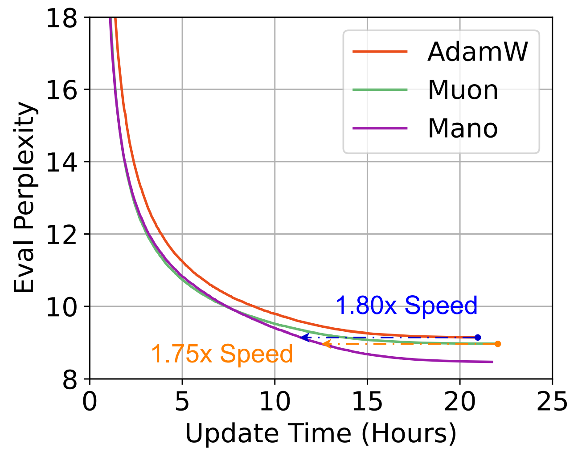
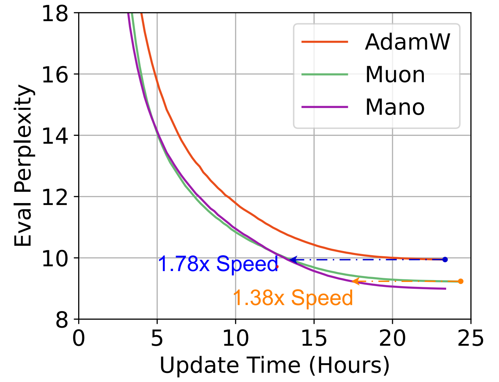
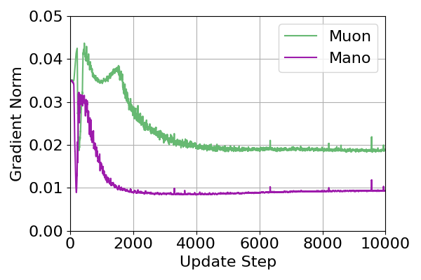
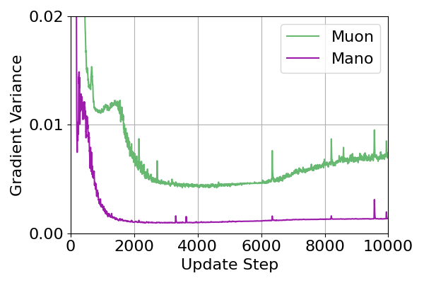
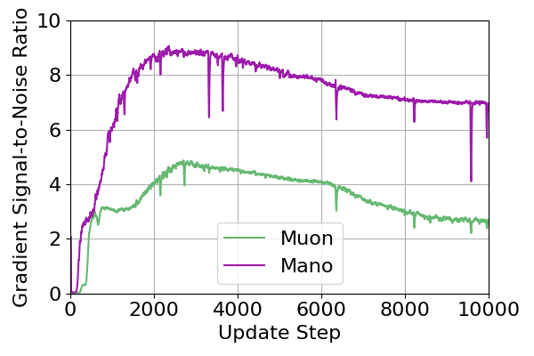

# Mano: Manifold Normalized Optimizer

The official code of "Mano: Restriking Manifold Optimization for LLM Training".

Mano may be the best optimizer so far for LLM training.

### Demonstration

| LLaMA-350M / Pile (10B Tokens) | LLaMA-1B (2.8B Tokens) / Pile |
| :---: | :---: |
|  |  |


| Gradient Norm | Gradient Variance | Signal-to-Noise Ratio |
| :---: | :---: | :---: |
|  |  |  |


### Example Usage:

```python
from mano import Mano

# Setup trainable parameters, track the input and output layer
trainable_params = [p for p in model.parameters() if p.requires_grad]
head_params = [*model.lm_head.parameters(), *model.model.embed_tokens.parameters()]
head_param_ids = {id(p) for p in head_params}

# Split up parameters for Mano (Muon) and AdamW
mano_params = [p for p in trainable_params if p.ndim >= 2 and id(p) not in head_param_ids]
mano_ids = {id(p) for p in mano_params}
adamw_params = [p for p in trainable_params if id(p) not in mano_ids]

# Initialize the Mano Optimizer
optimizer = Mano(mano_params=mano_params, lr=1e-3, wd=0.01, momentum=0.95, adamw_params=adamw_params, adamw_betas=(0.9, 0.95), adamw_eps=1e-8, nesterov=False)
```
